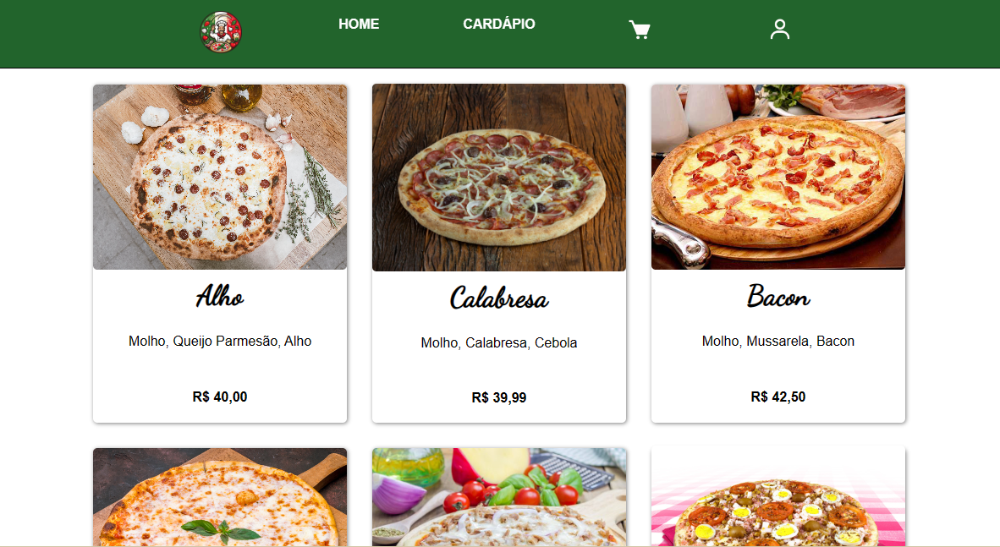

  <h1>DeliveryPizzaria</h1>
  <h2 ><a href="https://2962-2804-431-c7df-e6ef-69e7-a769-dfbe-6c75.ngrok-free.app/" target="_blank">Link Aplicação</a></h2>

  
Aplicação JAVA - JSX Delivery Pizzaria com Cadastro, login e inclusão de pedidos via cardápio e acompanhamento do mesmo.! - Trabalho colaborativo - UNIP

  

    <h3>Colaboradores</h3>
      

<a href="https://github.com/lmgleal">@Lucas</a>

      

<a href="https://github.com/Matheustmartins">@Mateus</a>

      

<a href="https://www.linkedin.com/in/pedro-augusto-lima-assis-814597244/">@Pedro</a>

      
    

